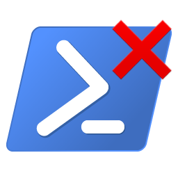

# PowerShell Essentials
Some basic scripts and profile customizations that everyone should try.

> :information_source: **Note:** This repository is a work in progress. I will be adding more scripts and customizations as I go.

> :warning: **DISCLAIMER:** While I am experienced and knowledgeable in PowerShell, I am not an expert. I am always learning and improving. If you see something that could be done better, please let me know.

<details open>
<summary><h3 style="display: inline">Table of Contents</h3></summary>

- [New to PowerShell? Start Here](#new-to-powershell-start-here)
	- [Making Sure You Have the Right Version](#making-sure-you-have-the-right-version)
	- [Downloading PowerShell 7](#downloading-powershell-7)
	- [Why PowerShell 7?](#why-powershell-7)
	- [The "Before you Begin" Basics](#the-before-you-begin-basics)
	- [PowerShell Profile](#powershell-profile)
	- [Understanding Execution Policies](#understanding-execution-policies)
- Customizing PowerShell
	- Profile Customizations
	- Profile Functions

</details>


<br />

# New to PowerShell? Start Here
If you are new to PowerShell, you should start by understanding these basics before you start using the scripts in this repository or experimenting with your own scripts.

## :warning: IMPORTANT
### Making Sure You Have the Right Version
***Make sure you are using the latest version of [PowerShell 7](https://learn.microsoft.com/en-us/powershell/scripting/install/installing-powershell?view=powershell-7.5)!*** Below are the two different icons for PowerShell 5 (blue) and PowerShell 7 (black). Make sure you are using the correct version.

[](https://learn.microsoft.com/en-us/powershell/scripting/whats-new/differences-from-windows-powershell?view=powershell-7.5) [](https://learn.microsoft.com/en-us/powershell/scripting/install/installing-powershell?view=powershell-7.5)

## Downloading PowerShell 7
There are several ways to install PowerShell 7 especially if you are using Windows. If you trust me and you're using Windows 10 or 11, you can just skip to the [WinGet commands](#basic-winget-installation-command-microsoft-official) below. Otherwise, see the official installation pages for more information:
- [Installing PowerShell on Windows](https://learn.microsoft.com/en-us/powershell/scripting/install/installing-powershell-on-windows?view=powershell-7.5)

The easiest and *Microsoft-recommended* method is to [Install PowerShell using WinGet](https://learn.microsoft.com/en-us/powershell/scripting/install/installing-powershell-on-windows?view=powershell-7.5#install-powershell-using-winget-recommended), which is the default package manager for Windows 10 and later. So, if you only have PowerShell 5.1.x, you can copy the following command line into PowerShell 5 to install PowerShell 7.

### Basic WinGet Installation Command (Microsoft Official)
I literally copied this command from the [official Microsoft documentation]((https://learn.microsoft.com/en-us/powershell/scripting/install/installing-powershell-on-windows?view=powershell-7.5#install-powershell-using-winget-recommended)).
```powershell
winget install --id Microsoft.PowerShell --source winget
```

### WinGet Installation + Auto-Update and Context Menu Integration
> :warning: **WARNING:** I have not tested this command yet.

Because WinGet uses the MSI installer, you can add flags to the WinGet command to enable options that you would find in the MSI setup. The following command *should* install PowerShell 7 using WinGet and enable automatic updates. If you aren't comfortable with this, you can always just use the [MSI installer directly](https://learn.microsoft.com/en-us/powershell/scripting/install/installing-powershell-on-windows?view=powershell-7.5#installing-the-msi-package).
```powershell
winget install --id Microsoft.Powershell --source winget --override "/qn ADD_EXPLORER_CONTEXT_MENU_OPENPOWERSHELL=1 ENABLE_MU=1"
```


## Why PowerShell 7?
Many versions of Windows come with the deprecated legacy version of PowerShell (v5.1.x). PowerShell 7.x is the current version, and not only is it significantly more powerful, but it is also **cross-platform**. PowerShell 7 is obviously built for Windows (10 and later), but it is also available for MacOS and Linux, albeit with some limitations.

## The "Before you Begin" Basics
### What is PowerShell?
**TLDR:** It's the command-line interface for Windows, meant to replace the old Command Prompt. PowerShell is a task automation and configuration management framework from Microsoft, consisting of a command-line shell and associated scripting language built on the [.NET Framework](https://dotnet.microsoft.com/en-us/learn/dotnet/what-is-dotnet-framework) using [Cmdlets](https://learn.microsoft.com/en-us/powershell/scripting/learn/deep-dives/everything-about-cmdlets?view=powershell-7.5) that are written in [C#](https://docs.microsoft.com/en-us/dotnet/csharp/).

### How do I open PowerShell?
There are several options, but I'll narrow them down to three categories:
1. **Windows Terminal**
	- This is the best option because it allows you to open multiple shells in one window, including PowerShell, Command Prompt, and even Linux shells.
	- If you're using Windows 11, it should be pre-installed.
	- If you don't have it, you can download it for free from the [Microsoft Store](https://www.microsoft.com/en-us/p/windows-terminal/9n0dx20hk701?activetab=pivot:overviewtab).
		- Windows Terminal is one of only a few apps that I recommend downloading from the Microsoft Store.
2. **Opening the PowerShell CLI Directly**
	- This is the OG way to open PowerShell, and probably how you did it if you used WinGet to install PowerShell 7.
	- Here are the easiest ways to open the PowerShell CLI directly:
		- Search for `PowerShell` or `pwsh` in the Start Menu.
		- Press <kbd>Win + X</kbd> and select `Windows PowerShell` or `Windows Terminal` (Windows 10/11).
		- Press <kbd>Win + R</kbd>, type `powershell` or `pwsh`, and press <kbd>Enter</kbd>.
		- You can also open the Command Prompt and type `powershell` or `pwsh` and press <kbd>Enter</kbd>, which is a bit silly compared to the other options, but it works.
3. **Using an Integrated Development Environment (IDE)**
	- An IDE is an advanced code editor that provides many features to help you write and manage your code, including an integrated terminal (where you would run PowerShell or any other shells you need).
	- Whether you're a developer or not, if you're going to be writing scripts or using PowerShell with any regularity, you should consider using an IDE, and I ***highly*** recommend [Visual Studio Code](https://code.visualstudio.com/).


## PowerShell Profile
If you plan to use PowerShell with any kind of regularity, you should consider customizing your PowerShell profile.

The PowerShell profile is a script that runs every time you start PowerShell. It is a great place to add customizations and functions that you want to be available every time you open a PowerShell session.

See the following official documentation for more information on the PowerShell profile:
- [Customizing your shell environment](https://learn.microsoft.com/en-us/powershell/scripting/learn/shell/creating-profiles?view=powershell-7.5) 
	- Introductory overview of the PowerShell profile.
- [about_Profiles](https://learn.microsoft.com/en-us/powershell/module/microsoft.powershell.core/about/about_profiles?view=powershell-7.5)
	- This is a more in-depth look at the PowerShell profile.
	- You can find the same information by running `Get-Help about_Profiles` in PowerShell.


## Understanding Execution Policies
